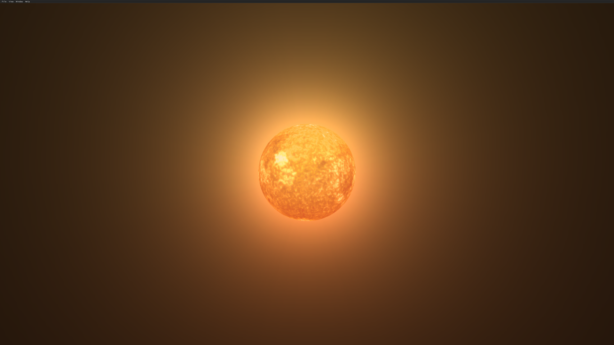
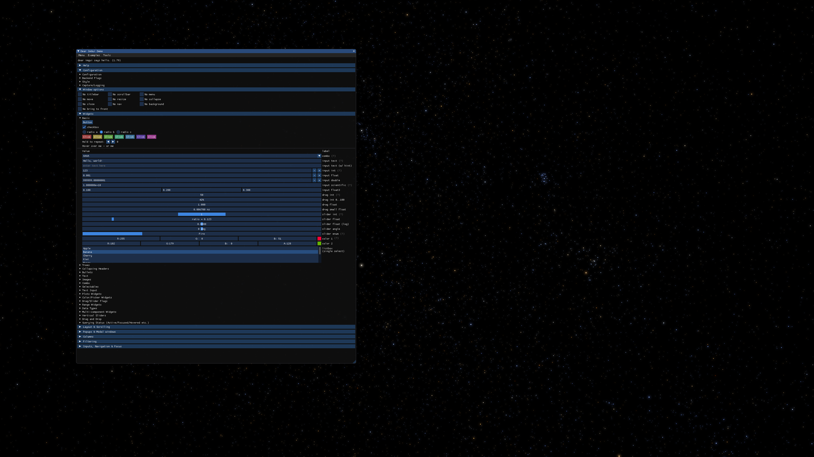

# Introduction
A real-time graphics engine geared toward astronomy visualizations/simulation. Basically a passion project, and nowhere near production ready, but is growing ever more capable. The architectural focus is a bit different from projects like Stellarium. I wanted to make it easy to import new data-sets, star catalogs, etc. so a significant effort has been spent on Python integration so tools like AstroPy can be easilly leveraged. Complete scenes can be defined and exported via a Python script and then loaded into the C++/Vulkan viewer. Some features include;

* Fast Vulkan renderer, MacOS support via MoltenVK
* Cross platform; Windows, Linux, MacOS
* ImGUI integration
* OpenXR integration for stereoscopic headset rendering
    * Tested on Valve Index. Theoretically works on other stereo headsets (not phone adaptors)
* Highly customizable and distributable scene files
    * Even the graphics pipeline configuration can be modified and serialized out to a custom scene via Python

#### Tycho2 Catalog Render

#### Bloom Effect on Star

#### Initial ImGUI integration (Hipparcos catalog in background)

# Current Efforts
* More features; bloom/blur effects, 3D stars, navigation, more elaborate scenes, etc.
* General stabilization of existing feautres and cross-platform builds     

### Supported Platforms
Windows, Linux, MacOS (hardware must support Metal). Windows is currently the active development environment and will be the most stable and likely to build off the mainline.

### Douloading Source Code
* Ensure git-lfs is installed or scene files will not be cloned
* git clone https://github.com/tlareywi/Infinitarium.git
* cd into `Infinitarium`
* git submodule update --init --recursive

### Build Dependencies
I'll get around to documenting this once things stabilize a bit. It's a Cmake build system, so it will let you know what's missing ;) But you at least need the following.
* Boost
* Boost_python3.x (sometimes a separate package in package managers)
* Python3.x (make sure the boost_python version matches your python version!)
* GLFW
* GLM
* VulkanSDK (this includes MoltenVK for MacOS)
* SQLite
* OpenXR (optional)

### Required Runtime Dependencies
* Python3.x
* Boost Serialization
* Boost_Python3.x
* SQLite
* GLFW

### Runtime Dependencies for building scenes (python)
* pip3 install astropy  
* pip3 install pillow  

### Usage
Startup scene has a minimal ImGui interface that allows loading of sample scenes such as Hipparcos and Tyco2 catalogs. The Scenegraph window allows exploration of the current scene nodes and interactive manipulation of shader uniforms. Various aspects of rendering such as star appearance can be adjusted this way. 

